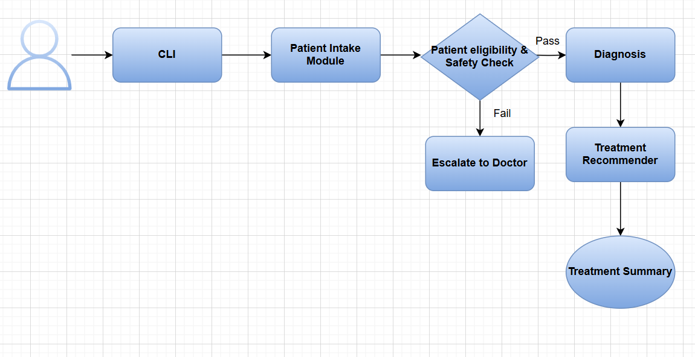

# Task 1: AI UTI Treatment Agent - Simple System Explanation

## What This System Does

Imagine having a smart medical assistant that can help treat urinary tract infections (UTIs) through a simple chat interface. This AI agent acts like a virtual nurse who can:
- Ask you questions about your symptoms
- Check if it's safe to treat you
- Give you a diagnosis
- Recommend the right medicine
- Tell you when to see a real doctor

## System Architecture

## How It Works (Step by Step)

### Step 1: Patient Talks to the System
- You open the program on your computer
- The system asks you questions like:
  - How old are you?
  - What symptoms do you have?
  - Do you have any allergies?
  - Are you pregnant?
  - What other health problems do you have?

The CLI (Command Line Interface) acts like a chat window, presenting questions one by one and collecting your typed responses. It's the conversational front-end that makes the system easy to use.

### Step 2: System Organizes Your Information
- The system takes all your answers and organizes them properly
- It extracts key information like age, symptoms, allergies, medical conditions
- It ensures all necessary data is collected and categorized correctly

The Patient Intake Module processes your raw input and structures it into a format the AI can understand. It separates your age, gender, specific symptoms (like burning during urination, frequency), allergies, and medical history into organized categories.

### Step 3: System Checks if It's Safe
- The AI looks at your answers and asks: "Is it safe for me to help this person?"
- It checks for red flags like:
  - Are you under 18? (If yes, see a doctor)
  - Do you have severe symptoms like fever? (If yes, go to emergency)
  - Are you pregnant? (If yes, see a doctor)
  - Do you have serious health problems? (If yes, see a doctor)

The Patient Eligibility & Safety Check applies predefined rules to your data. It acts like a virtual triage nurse, checking for age restrictions, emergency symptoms (fever, chills, flank pain), pregnancy status, and complex medical conditions. This is the critical decision point that determines if AI treatment is safe.

### Step 4: System Makes a Diagnosis
- If it's safe, the AI looks at your symptoms and decides:
  - "This looks like a UTI" or
  - "This doesn't look like a UTI" or
  - "I need more information"

The Diagnosis module analyzes your symptoms using clinical rules. It counts typical UTI symptoms (burning during urination, frequent urination, urgency, suprapubic pain) and applies established medical guidelines to determine the likelihood of a UTI.

### Step 5: System Recommends Treatment
- If it thinks you have a UTI, it picks the right antibiotic
- It tells you:
  - What medicine to take
  - How much to take
  - How long to take it
  - What to watch out for
The Treatment Recommender considers your diagnosis, allergies, and medical history to select the most appropriate antibiotic and dosage. It follows clinical guidelines to ensure the treatment is both effective and safe for your specific situation.

### Step 6: System Gives You Instructions
- It creates a summary of everything
- Tells you what to do next
- Reminds you when to see a doctor if needed

The Treatment Summary compiles all the information into an easy-to-understand format. It includes your diagnosis, recommended treatment (drug name, dosage, duration), safety warnings, follow-up instructions, and the reasoning behind the AI's decisions.

